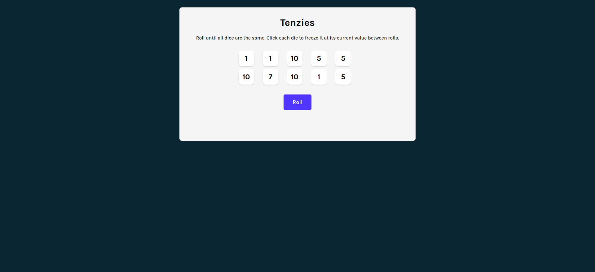
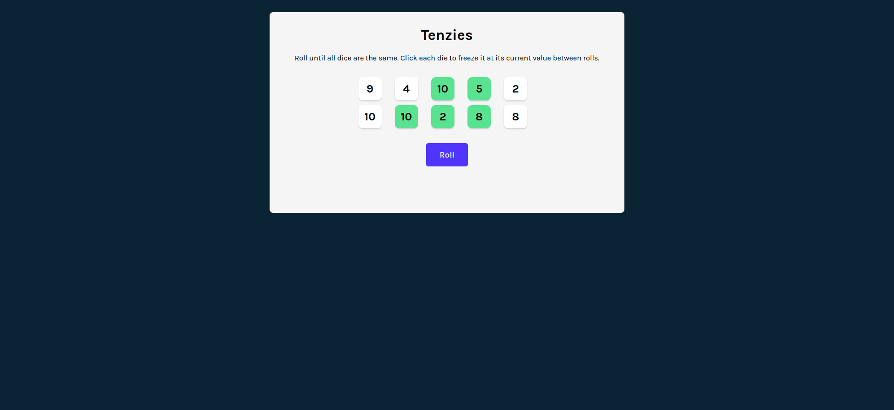

# Tenzies
`5x2` blocked game which u can roll the dice until the all selected numbers are same. And each roll generates random numbers in `1-10` scale  

**after roll** 

**Get start 🚀**

```
1. clone the project 
2. cd tenzies
3. npm install 
4. npm run dev